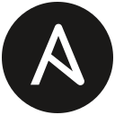
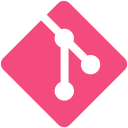
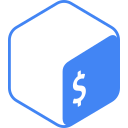

👋 Hi there! Viqi Agung Saputra here!

I'm a seasoned DevSecOps and Cloud Security Professional with over 10 years of experience in securing and automating robust infrastructure systems across multi-cloud environments. My passion lies in bridging the gap between development and operations, ensuring seamless integration and continuous delivery of high-quality, secure software.

🔧 **What I Do:**

**DevSecOps:** Seamlessly integrating security practices within the DevOps pipeline to ensure secure, efficient, and reliable code delivery and deployment.

**Cloud Security:** Designing and implementing security frameworks across Alibaba Cloud, AWS, GCP, and Azure, ensuring compliance with ISO 27001 and OJK regulatory standards.

**SRE:** Proactively maintaining and enhancing the reliability and scalability of services, ensuring they meet the highest standards of performance and availability.

**Automation:** Utilizing powerful tools like Ansible, Terraform, and Jenkins to automate repetitive tasks and streamline complex processes.

**Monitoring:** Implementing advanced monitoring and alerting systems with tools like Prometheus, Grafana, and the ELK stack to ensure proactive incident management.

🚀 **Skills & Tools:**

<table>
  <tr>
    <td style="vertical-align: top;"><strong>Cloud</strong></td>
    <td style="vertical-align: top;">
      

        
 AWS

        
 Azure

        
 GCP

        
 Alibaba Cloud

      

    </td>
  </tr>
  <tr>
    <td style="vertical-align: top;"><strong>CI/CD</strong></td>
    <td style="vertical-align: top;">
      

        
 Jenkins

        
 Argo CD

      

    </td>
  </tr>
  <tr>
    <td style="vertical-align: top;"><strong>Infrastructure as Code</strong></td>
    <td style="vertical-align: top;">
      

        
 Terraform

        
 Ansible

      

    </td>
  </tr>
  <tr>
    <td style="vertical-align: top;"><strong>Containers</strong></td>
    <td style="vertical-align: top;">
      

        
 Kubernetes

        
 Docker

      

    </td>
  </tr>
  <tr>
    <td style="vertical-align: top;"><strong>Security</strong></td>
    <td style="vertical-align: top;">
      

        
 Wazuh SIEM

        
 Palo Alto Cortex XDR

        
 Cloudflare

        
 Bearer Scan

        
 Dependency-Track

        
 SonarQube

      

    </td>
  </tr>
  <tr>
    <td style="vertical-align: top;"><strong>Monitoring</strong></td>
    <td style="vertical-align: top;">
      

        
 Prometheus

        
 Grafana

        
 Elasticsearch

      

    </td>
  </tr>
  <tr>
    <td style="vertical-align: top;"><strong>Version Control</strong></td>
    <td style="vertical-align: top;">
      

        
 Git

        
 GitHub

        
 GitLab

      

    </td>
  </tr>
  <tr>
    <td style="vertical-align: top;"><strong>Scripting</strong></td>
    <td style="vertical-align: top;">
      

        
 Bash

      

    </td>
  </tr>
</table>

🌟 **Professional Highlights:**
- Led cloud security control orchestration across Alibaba Cloud and AWS environments at PT Uangme Fintek Indonesia
- Spearheaded DevSecOps quality gates integration in Jenkins CI/CD pipelines with automated vulnerability scanning
- Successfully contributed to ISO 27001:2022 certification at Akulaku Finance Indonesia
- Established enterprise-grade observability frameworks reducing MTTR by 35%
- Achieved Top 150 recognition in Telkomsel Tech Titans League Series 3 (Cyber Security)

🔍 **Experience:**
- **Cloud Security & DevSecOps Engineer** at PT Uangme Fintek Indonesia
- **Site Reliability Engineer** at PT Akulaku Finance Indonesia
- **System Administrator (Cloud & Security)** at PT Astra Graphia Information Technology
- **IT Field Support & Network Analyst** at PT Astra Graphia Information Technology
- **IT Programming Analyst** at Telkom Indonesia

📫 **Let's Connect:**
- 📧 Email: [viqiagung@gmail.com](mailto:viqiagung@gmail.com)
- 💼 LinkedIn: [viqi-agung-saputra](https://linkedin.com/in/viqi-agung-saputra-ba2469142)
- 💻 GitHub: [@riqimaruq](https://github.com/riqimaruq)
- 🌐 Portfolio: https://riqimaruq.github.io/portofolio/

---
> DevSecOps • Cloud Security • SRE • Automation • Monitoring